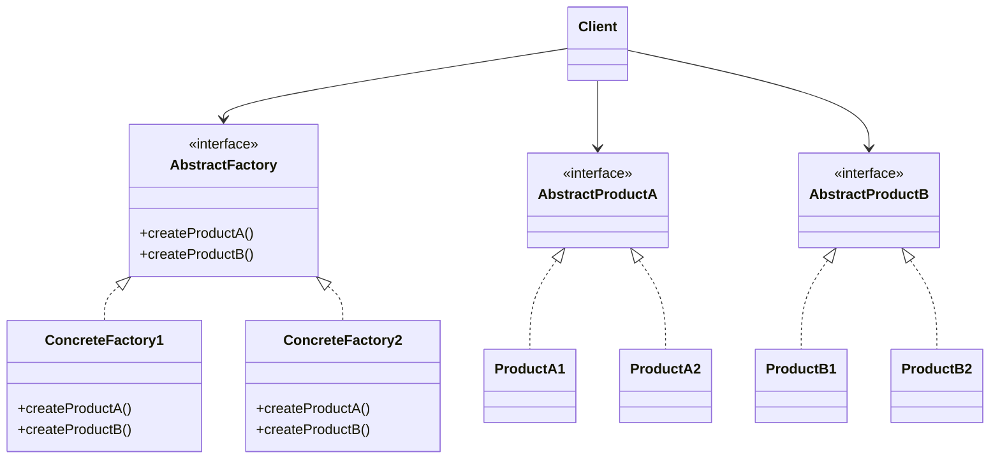
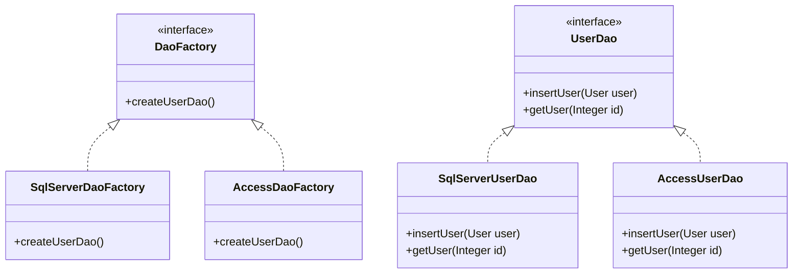
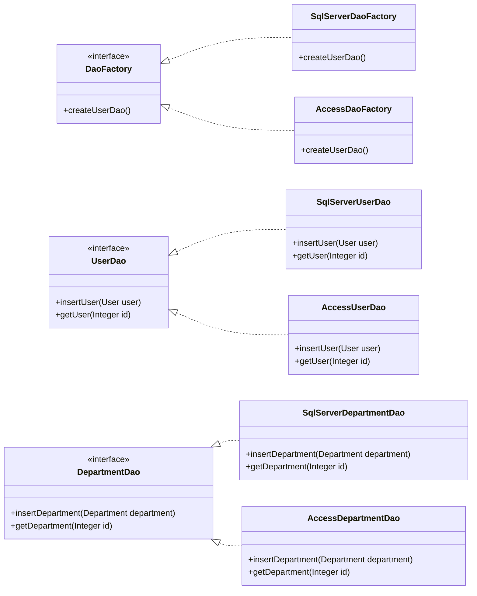
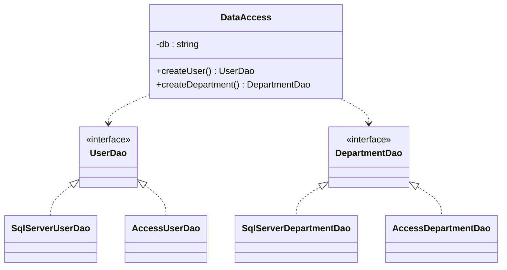

## 🚏 导论

> 抽象工厂模式（Abstract Factory Pattern），提供一个创建一系列相关或相互依赖对象的接口，而无需指定它们的具体类。当有多个相同的类要实现类似的功能，但是具体的实现细节有所不同，这时候就可以使用抽象工厂模式。

---

## 🧀 前置知识

- [工厂方法模式（Factory Method）](../factory_method/)

---

## 🚦 结构



AbstractProductA和AbstractProductB是两个抽象产品，之所以抽象，是因为它们有可能有不同的实现，而ProductA1、ProductA2、ProductB1、ProductB2是对两个抽象产品的具体分类实现。

AbstractFactory是一个抽象工厂，它里面包含所有产品创建的抽象方法，而ConcreteFactory1和ConcreteFactory2就是两个具体的工厂了。

通常在运行时在创建一个ConcreteFactory的实例，这个具体的工厂再创建具有特定实现的产品对象，也就是说，为创建不同的产品对象，客户端应使用不同的具体工厂。

---

## 🎭 优缺点分析

### 😊 优点

- 易于交换产品系列，由于具体工厂类在一个应用中只需要初始化的时候出现一次，这就使得改编一个应用的具体工厂变得非常简单。它只需要改变具体工厂即可使用不同的产品配置。
- 它让具体的创建实例过程与客户端分离，客户端通过抽象接口操纵实例，产品的具体类名也被具体工厂的实现分离，不会出现在客户端代码中。

### 🙁 缺点

- 增加需求时，需要增加新的产品类，并且要调整工厂类，这增加了系统的复杂度。
- 每次使用都需要声明Factory，但是如果要更改产品系列，那么就需要更改所有的Factory声明。

---

## 🎬 场景

公司有一个给第三方企业做的电子商务网站，使用SQL Server数据库，已经都大致完成了。但是公司又接了另外一家公司类似的需求项目，但是这家公司想省钱，要用Access数据库。因此任务就变成了要将整个项目调整为用Access数据库。

但是替换的过程中出现了很多问题。

- SQL Server的命名空间和Access数据库不同：SQL Server上用的是System.Data.SqlClient，而Access上用的是System.Data.OleDb。
- 数据库操作语法不同：
  - Access插入数据必须用INSERT INTO，而SQL Server用INSERT（不能用INTO）。
  - SQL Server中的GetDate()函数在Access中是Now()。
  - SQL Server中有Substring()函数，而Access中是Mid()。
- 关键字不同
  - Access不能用password作为字段名，因为它是关键字，而SQL Server可以。要使用关键字需要用[]括起来。
- ...

如果今后要换成其他数据库，那么这个项目就要重新调整。这样的设计显然是不合理的。

---

## 🛠 解决

### 最初的代码

用户实体: User.java

```java
public class User {
    private Integer id;
    private String name;

    public Integer getId() {
        return id;
    }

    public void setId(Integer id) {
        this.id = id;
    }

    public String getName() {
        return name;
    }

    public void setName(String name) {
        this.name = name;
    }
}
```

SqlServerUser.java: 用于操作User表

```java
public class SqlServerUser {
    public void insertUser(User user) {
        System.out.println("在SQL Server中给User表增加一条记录");
    }

    public User getUser(Integer id) {
        System.out.println("在SQL Server中根据ID得到User表一条记录");
        return null;
    }
}
```  

Client.java: 客户端测试类

```java
public class Client {
    public static void main(String[] args) {
        User user = new User();
        SqlServerUser su = new SqlServerUser();
        su.insertUser(user);
        su.getUser(1);
        System.out.println("-----------------------------------------");
    }
}
```

这里之所以不能换数据库，愿意在于SqlServerUser su = new SqlServerUser()使得su这个对象被框死在SQL Server上了。如果这里改成多态，那么在执行‘su.insertUser(user);’和‘su.getUser(1)’时就不需要考虑是Access还是Sql Server了。

### 初步改造

考虑用工厂方法模式（工厂方法模式是定义一个用于创建对象的接口，让子类决定实例化哪一个类）进行改造。



UserDao.java: UserDao接口

```java
public interface UserDao {
    /**
     * 插入用户
     * @param user 用户
     */
    void insert(User user);

    /**
     * 获取用户
     * @param id 用户id
     * @return 用户
     */
    User getUser(int id);
}
```

SqlServerUserDao.java: 用于访问SQL Server的User

```java
public class SqlServerUserDao implements UserDao {
    /**
     * 插入用户
     *
     * @param user 用户
     */
    @Override
    public void insert(User user) {
        System.out.println("在SQL Server中给User表增加一条记录");
    }

    /**
     * 获取用户
     *
     * @param id 用户id
     * @return 用户
     */
    @Override
    public User getUser(int id) {
        System.out.println("在SQL Server中根据id得到User表一条记录");
        return null;
    }
}
```

AccessUserDao.java: 用于访问Access的User

```java
public class AccessUserDao implements UserDao {
    /**
     * 插入用户
     *
     * @param user 用户
     */
    @Override
    public void insert(User user) {
        System.out.println("在Access中给User表增加一条记录");
    }

    /**
     * 获取用户
     *
     * @param id 用户id
     * @return 用户
     */
    @Override
    public User getUser(int id) {
        System.out.println("在Access中根据id得到User表一条记录");
        return null;
    }
}
```

DaoFactory.java: 定义一个创建访问User表对象的抽象的工厂接口

```java
public interface DaoFactory {
    /**
     * 创建UserDao对象
     * @return UserDao对象
     */
    UserDao createUserDao();
}
```

SqlServerDaoFactory.java: 实现SqlFactory接口，实例化SqlServerFactory类

```java
public class SqlServerDaoFactory implements DaoFactory {
    /**
     * 创建UserDao对象
     *
     * @return UserDao对象
     */
    @Override
    public UserDao createUserDao() {
        return new SqlServerUserDao();
    }
}
```

AccessDaoFactory.java: 实现SqlFactory接口，实例化AccessFactory类

```java
public class AccessDaoFactory implements DaoFactory{
    /**
     * 创建UserDao对象
     *
     * @return UserDao对象
     */
    @Override
    public UserDao createUserDao() {
        return new AccessUserDao();
    }
}
```

Client.java: 客户端测试类

```java
public class Client {
    public static void main(String[] args) {
        User user = new User();
//        DaoFactory factory = new SqlServerDaoFactory();
        DaoFactory factory = new AccessDaoFactory();
        UserDao userDao = factory.createUserDao();
        userDao.insert(user);
        userDao.getUser(1);
    }
}
```

这样，如果要换数据库，只需要修改DaoFactory factory = new AccessDaoFactory();即可，而对于UserDao接口的对象userDao事先根本不需要知道是访问哪个数据库。这就是所谓的业务逻辑与数据访问逻辑的解耦。

接下来除了User表，还有Department表，架构就会变成这样：



增加DepartmentDao.java，用于客户端访问，解除与具体数据库访问的耦合

```java
public interface DepartmentDao {

    /**
     * 插入部门
     * @param department 部门
     */
    void insert(Department department);

    /**
     * 根据id查询部门
     * @param id id
     * @return 部门
     */
    Department getDepartment(Integer id);
}
```

SqlServerDepartmentDao.java: 用于访问SQL Server的Department

```java
public class SqlServerDepartmentDao implements DepartmentDao {
    /**
     * 插入部门
     *
     * @param department 部门
     */
    @Override
    public void insert(Department department) {
        System.out.println("在SQL Server中给Department表增加一条记录");
    }

    /**
     * 根据id查询部门
     *
     * @param id id
     * @return 部门
     */
    @Override
    public Department getDepartment(Integer id) {
        System.out.println("在SQL Server中根据id得到Department表一条记录");
        return null;
    }
}

```

AccessDepartmentDao.java: 用于访问Access的Department

```java
public class AccessDepartmentDao implements DepartmentDao {
    /**
     * 插入部门
     *
     * @param department 部门
     */
    @Override
    public void insert(Department department) {
        System.out.println("在Access中给Department表增加一条记录");
    }

    /**
     * 根据id查询部门
     *
     * @param id id
     * @return 部门
     */
    @Override
    public Department getDepartment(Integer id) {
        System.out.println("在Access中根据id得到Department表一条记录");
        return null;
    }
}
```

在DaoFactory.java中增加创建DepartmentDao对象的方法

```java
    /**
     * 创建DepartmentDao对象
     * @return DepartmentDao对象
     */
    DepartmentDao createDepartmentDao();
```

SqlServerDaoFactory.java中增加创建DepartmentDao对象的方法

```java
    /**
     * 创建DepartmentDao对象
     *
     * @return DepartmentDao对象
     */
    @Override
    public DepartmentDao createDepartmentDao() {
        return new SqlServerDepartmentDao();
    }
```

AccessDaoFactory.java中增加创建DepartmentDao对象的方法

```java
    /**
     * 创建DepartmentDao对象
     *
     * @return DepartmentDao对象
     */
    @Override
    public DepartmentDao createDepartmentDao() {
        return new AccessDepartmentDao();
    }
```

最后Client.java

```java
public class Client {
    public static void main(String[] args) {
        User user = new User();
        DaoFactory factory = new SqlServerDaoFactory();
//        DaoFactory factory = new AccessDaoFactory();
        UserDao userDao = factory.createUserDao();
        userDao.insert(user);
        userDao.getUser(1);

        DepartmentDao departmentDao = factory.createDepartmentDao();
        departmentDao.insert(new Department());
        departmentDao.getDepartment(1);
    }
}
```

输出的结果为：

```shell
在SQL Server中给User表增加一条记录
在SQL Server中根据id得到User表一条记录
在SQL Server中给Department表增加一条记录
在SQL Server中根据id得到Department表一条记录
```

这样整个架构已经演进为了抽象工厂模式。当只有一个类需要被工厂方法创建的时候，是工厂方法模式，而涉及多个产品系列的问题，这种工厂模式叫做抽象工厂模式（Abstract Factory Pattern）。

### 用简单工厂模式改进抽象工厂

由于抽象工厂的[缺点](#-缺点)中提到，每次使用都需要声明Factory，但是如果要更改产品系列，那么就需要更改所有的Factory声明。这里可以用简单工厂模式改进。

直接去除DaoFactory、SqlServerDaoFactory、AccessDaoFactory，改用DataAccess类。



DataAccess.java

```java
public class DataAccess {
    private static final String DB = "SQLServer";
//    private static final String DB = "Access";

    /**
     * 创建用户Dao
     * @return UserDao
     */
    public static UserDao createUserDao(){
        UserDao userDao = null;
        switch (DB){
            case "SQLServer":
                userDao = new SqlServerUserDao();
                break;
            case "Access":
                userDao = new AccessUserDao();
                break;
            default:
                break;
        }
        return userDao;
    }

    /**
     * 创建部门Dao
     * @return DepartmentDao
     */
    public static DepartmentDao createDepartmentDao(){
        DepartmentDao departmentDao = null;
        switch (DB){
            case "SQLServer":
                departmentDao = new SqlServerDepartmentDao();
                break;
            case "Access":
                departmentDao = new AccessDepartmentDao();
                break;
            default:
                break;
        }
        return departmentDao;
    }
}
```

Client.java 客户端代码

```java
public class Client {
    public static void main(String[] args) {
        User user = new User();
        Department department = new Department();

        UserDao userDao = DataAccess.createUserDao();
        userDao.insert(user);
        userDao.getUser(1);

        DepartmentDao departmentDao = DataAccess.createDepartmentDao();
        departmentDao.insert(department);
        departmentDao.getDepartment(1);
    }
}
```

这样的设计客户端代码可以不出现具体数据库名称，使得需要修改数据库时，只需要在DataAccess修改DB的内容就可以了。但是如果需要增加新的数据库支持，就还需要调整Access的switch结构，原来只需要增加一个工厂类就好了。

### 用反射+抽象工厂的数据访问程序

为了解决既不修改switch代码结构，也不让客户端出现具体数据库名称。可以引入反射的思想，通过字符串实例化对应的类。
修改后如下所示

```java
public class DataAccess {
    private static final String DB = "SqlServer";
    private static final String packageName = "space.rexhub.designpatterns.creational.abstract_factory.dao.impl";

    /**
     * 创建用户Dao
     * @return UserDao
     */
    public static UserDao createUserDao(){
        UserDao userDao = null;
        String className = packageName + "." + DB + "UserDao";
        try {
            Constructor<?> constructor = Class.forName(className).getDeclaredConstructor();
            userDao = (UserDao) constructor.newInstance();
        } catch (Exception e) {
            throw new RuntimeException(e);
        }
        return userDao;
    }

    /**
     * 创建部门Dao
     * @return DepartmentDao
     */
    public static DepartmentDao createDepartmentDao(){
        DepartmentDao departmentDao = null;
        String className = "space.rexhub.designpatterns.creational.abstract_factory.dao.impl." + DB + "DepartmentDao";
        try {
            Constructor<?> constructor = Class.forName(className).getConstructor();
            departmentDao = (DepartmentDao) constructor.newInstance();
        } catch (Exception e) {
            throw new RuntimeException(e);
        }
        return departmentDao;
    }
}
```

这样，只需要修改DB的值，就可以实现不同数据库的切换，并且不需要修改switch结构。如果我们需要提供Oracle的支持，只需要创建OracleUserDao和OracleDepartmentDao类，然后修改DB的值即可。

但还是可以挑出毛病，切换数据库还是需要在代码里进行修改，能否不修改代码就能切换数据库呢？

### 用反射+配置文件实现数据访问程序

为了不修改数据库就能切换数据库，可以将数据库名称放在配置文件中，然后通过反射实例化对应的类。

创建一个
database_config.properties文件，内容如下：

```properties
DB = SqlServer
```

DataAccess.java只需要从配置文件中获取DB就可以了

```java
public class DataAccess {
    private static final String PACKAGE_NAME = "space.rexhub.design_patterns.creational.abstract_factory.dao.impl";
    private static String DB;

    static{
        Properties properties = new Properties();
        try {
            properties.load(new FileInputStream("space/rexhub/design_patterns/creational/abstract_factory/database_config.properties"));
            DB = (String) properties.get("DB");
        } catch (IOException e) {
            DB = null;
        }
    }
    /**
     * 创建用户Dao
     * @return UserDao
     */
    public static UserDao createUserDao(){
        UserDao userDao = null;
        String className = PACKAGE_NAME + "." + DB + "UserDao";
        try {
            Constructor<?> constructor = Class.forName(className).getDeclaredConstructor();
            userDao = (UserDao) constructor.newInstance();
        } catch (Exception e) {
            throw new RuntimeException(e);
        }
        return userDao;
    }

    /**
     * 创建部门Dao
     * @return DepartmentDao
     */
    public static DepartmentDao createDepartmentDao(){
        DepartmentDao departmentDao = null;
        String className = PACKAGE_NAME + "." + DB + "DepartmentDao";
        try {
            Constructor<?> constructor = Class.forName(className).getConstructor();
            departmentDao = (DepartmentDao) constructor.newInstance();
        } catch (Exception e) {
            throw new RuntimeException(e);
        }
        return departmentDao;
    }
}
```

这样这个数据库切换的问题就可以相对较完美的解决了，我们应用了反射+抽象工厂模式解决了数据库访问时的可维护、可扩展问题。
