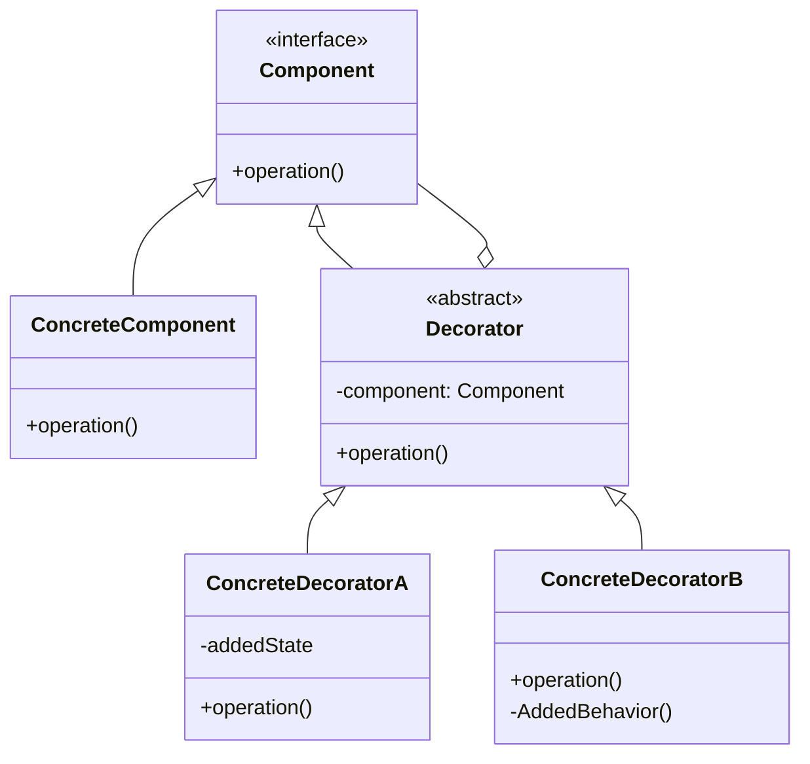
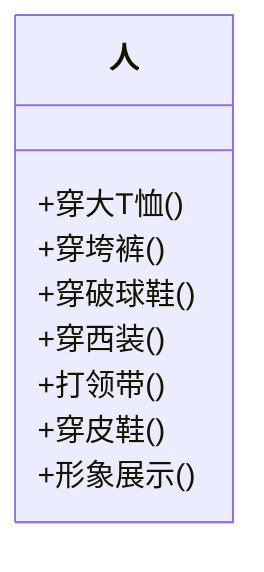
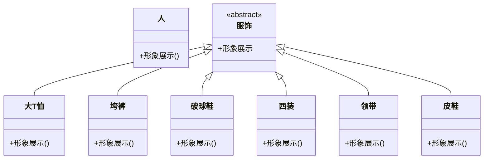
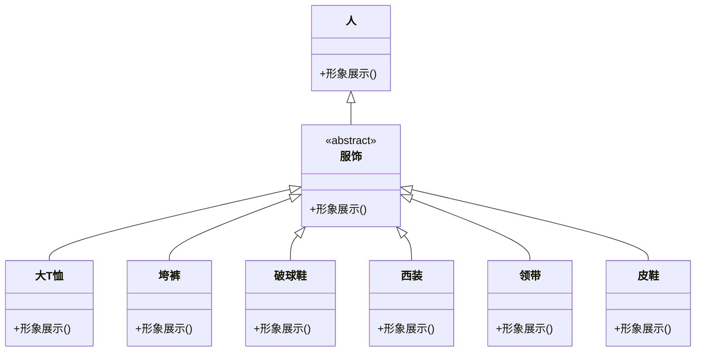

## 🚏 导论

> 装饰模式（Decorator Pattern）：动态地给一个对象添加一些额外的职责。就增加功能来说，装饰模式比生成子类更为灵活。当现有目标功能不足的时候，需要增强时，可以考虑使用装饰模式。

装饰模式把每个要装饰的代码放在单独的类中，并让这个类包装它所要装饰的对象，因此，当需要执行特殊行为时，客户代码就可以在运行时根据需要有选择地、按顺序地使用装饰功能包装对象了。

装饰器常在面向切面编程（AOP）中使用，比如日志、事务、权限等功能。

---

## 🚦 结构

### UML类图



Component是定义一个对象接口，可以给这些对象动态地添加职责。ConcreteComponent是定义了一个具体的对象，也可以给这个对象添加一些职责。Decorator，装饰抽象类，继承了Component，从外类来扩展Component类的功能，但对于Component来说，是无需知道Decorator的存在的。至于ConcreteDecorator就是具体的装饰对象，起到给Component添加职责的功能。

装饰模式是利用setComponent来对对象进行包装的。这样每个装饰对象的实现就和如何使用这个对象分离开了，每个装饰对象只关心自己的功能，不需要关心如何被添加到对象链当中。

### 基本代码

Component类

```java
public interface Component {
    void operation();
}
```

ConcreteComponent类

```java
public class ConcreteComponent implements Component {
    @Override
    public void operation() {
        System.out.println("具体对象的操作");
    }
}
```

Decorator类

```java
public abstract class Decorator implements Component {
    protected Component component;

    public void setComponent(Component component) {
        this.component = component;
    }

    @Override
    public void operation() {
        if (component != null) {
            component.operation();
        }
    }
}
```

ConcreteDecoratorA类

```java
public class ConcreteDecoratorA extends Decorator {
    private String addedState;

    @Override
    public void operation() {
        super.operation();
        addedState = "New State";
        System.out.println("具体装饰对象A的操作");
    }
}
```

ConcreteDecoratorB类

```java
public class ConcreteDecoratorB extends Decorator {
    @Override
    public void operation() {
        super.operation();
        addedBehavior();
        System.out.println("具体装饰对象B的操作");
    }

    private void addedBehavior() {
        System.out.println("为具体装饰对象B增加额外的行为addedBehavior()");
    }
}
```

客户端代码

```java
public class Client {
    public static void main(String[] args) {
        Component component = new ConcreteComponent();
        Decorator decoratorA = new ConcreteDecoratorA();
        Decorator decoratorB = new ConcreteDecoratorB();

        decoratorA.setComponent(component);
        decoratorB.setComponent(decoratorA);

        decoratorA.operation();
        decoratorB.operation();
    }
}
```

---

## 🎭 优缺点分析

---

### 😊 优点

- 有效地将类的核心职责和装饰功能区分开，而且可以去除相关类中重复的装饰逻辑。

### 🙁 缺点

- 会产生很多小对象，增加了系统的复杂性。

---

## 🎬 场景

现有一需求，要求写一个可以给人搭配不同服饰的系统，比如类似QQ、网络游戏或论坛都有的Avatar系统。

---

## 🛠 解决

### 第一版代码



Person类的代码如下：

```java
public class Person {

    /**
     * 姓名
     */
    private String name;

    public Person(String name) {
        this.name = name;
    }

    public void wearTShirts() {
        System.out.print("大T恤 ");
    }

    public void wearBigTrouser() {
        System.out.print("垮裤 ");
    }

    public void wearSneakers() {
        System.out.print("破球鞋 ");
    }

    public void wearSuit() {
        System.out.print("西装 ");
    }

    public void wearTie() {
        System.out.print("领带 ");
    }

    public void wearLeatherShoes() {
        System.out.print("皮鞋 ");
    }

    public void show() {
        System.out.print("装扮的" + name);
    }
}
```

客户端代码：

```java
public class Client {
    public static void main(String[] args) {
        Person rex = new Person("Rex");

        System.out.print("\n第一种装扮：");

        rex.wearTShirts();
        rex.wearBigTrouser();
        rex.wearSneakers();
        rex.show();

        System.out.print("\n第二种装扮：");
        rex.wearSuit();
        rex.wearTie();
        rex.wearLeatherShoes();

        rex.show();
    }
}
```

但是这样就违背了开闭原则，如果要增加一种装扮，就需要修改Person类，这样就不符合开闭原则。可以考虑将这些服饰都写成子类。

### 第二版代码（用面向对象的思路构造）



Person类

```java
public class Person {

    /**
     * 姓名
     */
    private String name;

    public Person(String name) {
        this.name = name;
    }

    public void show() {
        System.out.print("装扮的" + name);
    }
}
```

服饰抽象类

```java
public abstract class Finery {

    /**
     * 服饰抽象方法
     */
    public abstract void show();
}
```

各种服饰子类

```java
public class BigTrouser extends Finery {
    /**
     * 垮裤展示
     */
    @Override
    public void show() {
        System.out.print("垮裤 ");
    }
}

public class LeatherShoes extends Finery {
    /**
     * 皮鞋展示
     */
    @Override
    public void show() {
        System.out.print("皮鞋 ");
    }
}


// ...
```

客户端类

```java
public class Client {
    public static void main(String[] args) {
        Person rex = new Person("Rex");

        System.out.print("\n第一种装扮：");
        Finery tShirts = new TShirts();
        Finery bigTrouser = new BigTrouser();
        Finery sneakers = new Sneakers();
        tShirts.show();
        bigTrouser.show();
        sneakers.show();
        rex.show();

        System.out.print("\n第二种装扮：");
        Finery suit = new Suit();
        Finery tie = new Tie();
        Finery leatherShoes = new LeatherShoes();

        suit.show();
        tie.show();
        leatherShoes.show();
        rex.show();

    }
}
```

虽然改写成了面向对象写法，实现了“服饰”与“人”类的分离，但是分离的有点过度了，这就好像一个人当众光着身子将衣服穿起来，应该是要在内部组装好再展示出来。

### 第三版（用装饰模式改造）



"Person"类(ConcreteComponent)

```java
public class Person {

    /**
     * 姓名
     */
    private String name;


    public Person() {
    }

    public Person(String name) {
        this.name = name;
    }

    public void show() {
        System.out.print("装扮的" + name);
    }
}
```

服饰类(Decorator)

```java
public class Finery extends Person {
    /**
     * 被装饰者
     */
    protected Person component;

    /**
     * 装饰
     *
     * @param component 被装饰者
     */
    public void decorate(Person component) {
        this.component = component;
    }

    /**
     * 展示
     */
    @Override
    public void show() {
        if (component != null) {
            component.show();
        }
    }
}
```

具体服饰类(ConcreteDecorator)

```java
public class BigTrouser extends Finery {
    /**
     * 垮裤展示
     */
    @Override
    public void show() {
        System.out.print("垮裤 ");
        super.show();
    }
}
public class LeatherShoes extends Finery {
    /**
     * 皮鞋展示
     */
    @Override
    public void show() {
        System.out.print("皮鞋 ");
        super.show();
    }
}
//...
```

客户端类

```java
public class Client {
    public static void main(String[] args) {
        Person rex = new Person("Rex");

        System.out.print("\n第一种装扮：");
        TShirts tShirts = new TShirts();
        BigTrouser bigTrouser = new BigTrouser();
        Sneakers sneakers = new Sneakers();
        sneakers.decorate(rex);
        bigTrouser.decorate(sneakers);
        tShirts.decorate(bigTrouser);
        tShirts.show();

        System.out.print("\n第二种装扮：");
        Finery suit = new Suit();
        Finery tie = new Tie();
        Finery leatherShoes = new LeatherShoes();

        leatherShoes.decorate(rex);
        tie.decorate(leatherShoes);
        suit.decorate(tie);
        rex.show();
    }
}
```
