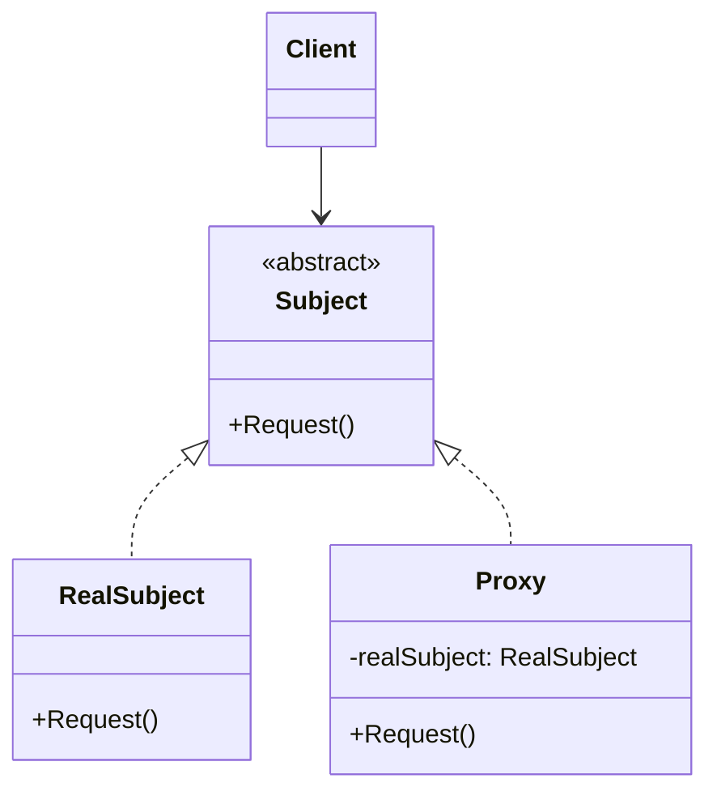
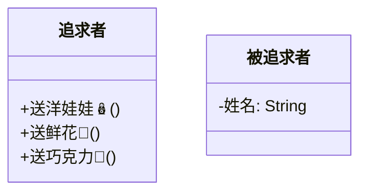

## 🚏 导论

> 代理模式（Proxy Pattern）为其他对象提供一种代理以控制对这个对象的访问。

代理模式的应用场景

1. 远程代理，也就是为一个对象在不同的地址空间提供局部代表。这样可以隐藏一个对象存在于不同地址空间的事实。
2. 虚拟代理，是根据需要创建开销很大的对象。通过它来存放实例化需要很长时间的真实对象。
3. 安全代理，用来控制真实对象访问时的权限。
4. 智能指引，是指当调用真实的对象时，代理处理另外一些事。

---

## 🚦 结构

### UML类图



### 代码实现

Subject类，定义了RealSubject和Proxy的公共接口，这样就在任何使用RealSubject的地方都可以使用Proxy

```java
public class abstract Subject {
    public abstract void Request();
}
```

RealSUbject类，定义Proxy所代表的真实实体

```java
public class RealSubject extends Subject {
    @Override
    public void Request() {
        System.out.println("真实的请求");
    }
}
```

Proxy类，保存一个引用使得代理可以访问实体，并提供一个与Subject相同的接口，这样代理就可以用来代替实体

```java
public class Proxy extends Subject {
    private RealSubject realSubject;

    @Override
    public void Request() {
        if (realSubject == null) {
            realSubject = new RealSubject();
        }
        realSubject.Request();
    }
}
```

客户端代码

```java
public class Client {
    public static void main(String[] args) {
        Proxy proxy = new Proxy();
        proxy.Request();
    }
}
```

---

## 🎭 优缺点分析

---

### 😊 优点

### 🙁 缺点

---

## 🎬 场景

一个谈恋爱的问题，小刚喜欢小红，但是小刚不好意思直接追小红，于是乎他找了小明帮忙，想让小明帮他送礼物给小红。这样的关系如何用代码来实现呢？

---

## 🛠 解决

### 没有代理的代码

首先来尝试写出，如果小刚直接追小红的代码。


