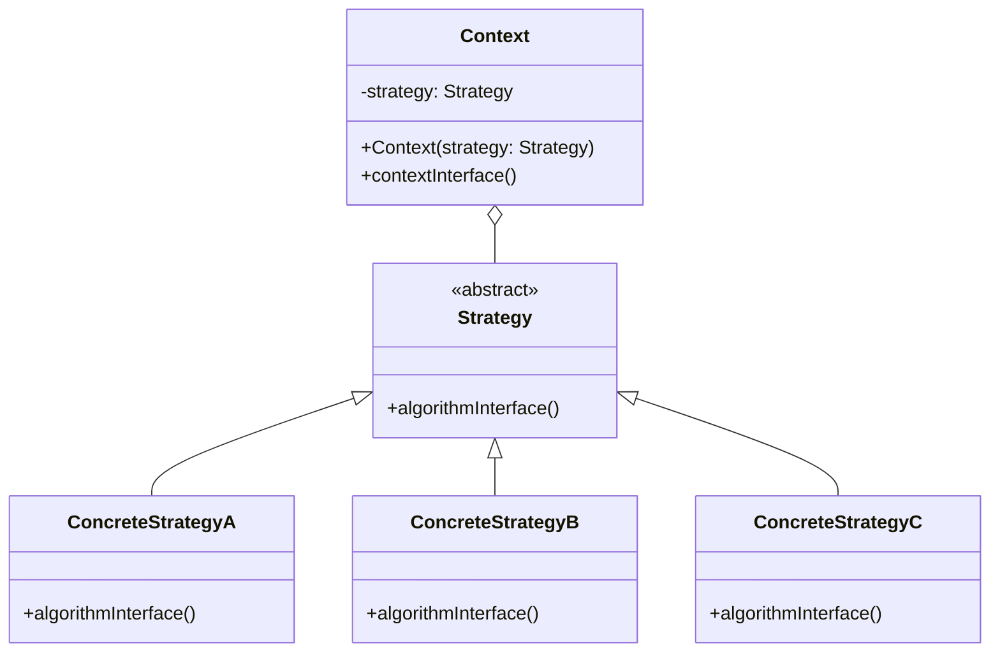
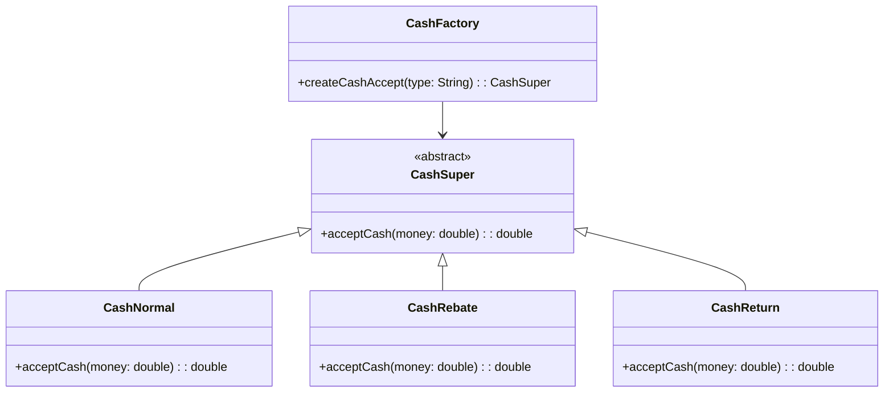
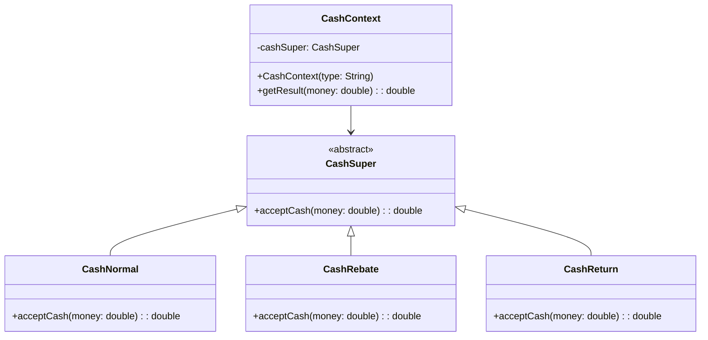

## 🚏 导论

> 它定义了算法家族，分别封装起来，让它们之间可以互相替换，此模式让算法的变化，不会影响到使用算法的客户。可以用策略模式封装几乎任何类型的规则，只要分析过程中听到需要在不同时间应用不同的业务规则，就可以考虑使用策略模式处理这些变化的可能性。

---

## 🧀 前置知识

---

## 🚦 结构

### UML 类图



### 基本代码

Strategy类，定义所有支持的算法的公共接口。

```java
public abstract class Strategy {
  
    /**
     * 算法方法
     */
    public abstract void algorithmInterface();
}
```

ConcreteStrategy类，实现具体的算法。

```java
class ConcreteStrategyA extends Strategy {
  
    @Override
    public void algorithmInterface() {
        System.out.println("算法A实现");
    }
}
class ConcreteStrategyB extends Strategy {
  
    @Override
    public void algorithmInterface() {
        System.out.println("算法B实现");
    }
}

class ConcreteStrategyC extends Strategy {
  
    @Override
    public void algorithmInterface() {
        System.out.println("算法C实现");
    }
}
```

Context, 用一个ConcreteStrategy来配置，维护一个对Strategy对象的引用。

```java
public class Context {
  
    private Strategy strategy;
  
    public Context(Strategy strategy) {
        this.strategy = strategy;
    }
  
    public void contextInterface() {
        strategy.algorithmInterface();
    }
}
```

客户端代码

```java
public static void main(String[] args) {
    Context context;
    context = new Context(new ConcreteStrategyA());
    context.contextInterface();
    context = new Context(new ConcreteStrategyB());
    context.contextInterface();
    context = new Context(new ConcreteStrategyC());
    context.contextInterface();
}
```

---

## 🎭 优缺点分析

---

### 😊 优点

- 策略模式的Strategy层次为Context定义了一系列可重用的算法或行为。继承有助于提取这些算法的公共功能。
- 简化了单元测试，因为每个算法都有自己的类，可以通过自己的接口单独测试。

### 🙁 缺点

- 在基本的策略模式中，选择所用具体实现的职责有客户端对象承担，并转给策略模式的Context对象，其实并没有减轻客户端的负担。（可以考虑💭用策略模式+简单工厂模式，但即使是这种方式，也有不足之处，每次更改 算法都要修改Context中的switch代码，这个问题可以用反射来解决）

---

## 🎬 场景

现要做一个商场收银系统，营业员根据客户所购买商品的单价和数量，向客户收费。如下图所示：


初步设计后，关键代码如下所示：

```java
// 确定按钮的动作监听器
confirmButton.addActionListener(new ActionListener() {
    
    // 声明一个double变量total来计算总计
    double total = 0.0;
    
    @Override
    public void actionPerformed(ActionEvent e) {
        try {

            // 声明一个double变量totalPrices来计算每个商品的单价(txtPrices) * 数量(txtNum)后的合计
            double totalPrices = Double.parseDouble(priceField.getText()) * Integer.parseInt(quantityField.getText());

            // 将每个商品合计计入总计
            total = total + totalPrices;

            // 更新商品列表
            itemList.append(String.format("单价: %s, 数量: %s, 小计: %.2f\n", priceField.getText(), quantityField.getText(), totalPrices));

            totalAmount.setText(String.format("%.2f", total));
        } catch (NumberFormatException ex) {
            JOptionPane.showMessageDialog(frame, "请输入有效的数字！", "错误", JOptionPane.ERROR_MESSAGE);
        }
    }
});

```

但是如果要增加打折功能，就需要修改代码，在totalPrices后乘以折扣，商场活动结束再修改回去。
显然不够灵活。

这时候可以考虑增加下拉选项，选择不同的折扣方式，如下图所示：


修改后的代码如下所示：

```java
// 创建下拉框，可以选择折扣
JComboBox<String> discountComboBox = new JComboBox<>(new String[]{"正常收费", "打八折", "打七折", "打五折"});
discountComboBox.setBounds(100, 110, 150, 25);
frame.add(discountComboBox);

// 确定按钮的动作监听器
confirmButton.addActionListener(new ActionListener() {

    // 声明一个double变量total来计算总计
    double total = 0.0;

    @Override
    public void actionPerformed(ActionEvent e) {
        try {
            int selectedIndex = discountComboBox.getSelectedIndex();
            double discount = 1;
            switch (selectedIndex) {
                case 1:
                    discount = 0.8;
                    break;
                case 2:
                    discount = 0.7;
                    break;
                case 3:
                    discount = 0.5;
                    break;
                default:
                    discount = 1;
                    break;
            }
            System.out.println("选中的折扣：" + selectedIndex);
            // 声明一个double变量totalPrices来计算每个商品的单价(txtPrices) * 数量(txtNum)后的合计
            double totalPrices = Double.parseDouble(priceField.getText()) * Integer.parseInt(quantityField.getText()) * discount;
            // 将每个商品合计计入总计
            total = total + totalPrices;
            // 更新商品列表
            itemList.append(String.format("单价: %s, 数量: %s, 活动: %s, 小计: %.2f\n",
                    priceField.getText(), quantityField.getText(), discountComboBox.getSelectedItem(), totalPrices));
            totalAmount.setText(String.format("%.2f", total));
        } catch (NumberFormatException ex) {
            JOptionPane.showMessageDialog(frame, "请输入有效的数字！", "错误", JOptionPane.ERROR_MESSAGE);
        }
    }
});
```

这样修改后的代码虽然实现了功能，但是代码量增加，且不够灵活。每次增加新的折扣方式，都需要修改代码。

---

## 🛠 解决

### 简单工厂模式

当折扣的业务变多时，频繁修改计算总价代码，不符合开闭原则。可以使用简单工厂模式，将计算总价的代码抽取出来，放到一个类中，根据不同的折扣方式，创建不同的类。



现金收费抽象类

```java
public abstract class CashSuper{

    /**
     * 现金收取超类的抽象方法
     * @param money 原价
     * @return 折后价
     */
    public abstract double acceptCash(double money);
}
```

正常收费子类：

```java
public class CashNormal extends CashSuper{
    /**
     * 正常收费
     *
     * @param money 原价
     * @return 折后价
     */
    @Override
    public double acceptCash(double money) {
        return money;
    }
}
```

打折收费子类：

```java
public class CashRebate extends CashSuper{

    private double moneyRebate = 1d;

    public CashRebate(String moneyRebate) {
        this.moneyRebate = Double.parseDouble(moneyRebate);
    }

    /**
     * 打折收费
     *
     * @param money 原价
     * @return 折后价
     */
    @Override
    public double acceptCash(double money) {
        return money * moneyRebate;
    }
}
```

返利收费子类：

```java
public class CashReturn extends CashSuper{

    private double moneyCondition = 0.0d;

    private double moneyReturn = 0.0d;

    public CashReturn(String moneyCondition, String moneyReturn) {
        this.moneyCondition = Double.parseDouble(moneyCondition);
        this.moneyReturn = Double.parseDouble(moneyReturn);
    }
    /**
     * 返利收费
     *
     * @param money 原价
     * @return 折后价
     */
    @Override
    public double acceptCash(double money) {
        double result = money;
        if (money >= moneyCondition) {
            result = money - Math.floor(money / moneyCondition) * moneyReturn;
        }
        return result;
    }
}
```

现金收费工厂类：

```java
public class CashFactory {

    /**
     * 现金收取工厂
     * @param type 收费类型
     * @return CashSuper
     */
    public static CashSuper createCashAccept(String type){
        CashSuper cs = null;
        switch (type){
            case "正常收费":
                cs = new CashNormal();
                break;
            case "满300返100":
                cs = new CashReturn("300","100");
                break;
            case "打8折":
                cs = new CashRebate("0.8");
                break;
            default:
                break;
        }
        return cs;
    }
}
```

客户端主要部分：

```java
// 创建下拉框，可以选择折扣
JComboBox<String> discountComboBox = new JComboBox<>(new String[]{"正常收费", "满300返100", "打8折"});
discountComboBox.setBounds(100, 110, 150, 25);
frame.add(discountComboBox);

// 确定按钮的动作监听器
confirmButton.addActionListener(new ActionListener() {

    // 声明一个double变量total来计算总计
    double total = 0.0;

    @Override
    public void actionPerformed(ActionEvent e) {
        try {
            String cashType = (String) discountComboBox.getSelectedItem();
            CashSuper cs = CashFactory.createCashAccept(cashType);
            // 声明一个double变量totalPrices来计算每个商品的单价(txtPrices) * 数量(txtNum)后的合计
            double totalPrices = cs.acceptCash(Double.parseDouble(priceField.getText()) * Integer.parseInt(quantityField.getText()));
            // 将每个商品合计计入总计
            total = total + totalPrices;
            // 更新商品列表
            itemList.append(String.format("单价: %s, 数量: %s, 活动: %s, 小计: %.2f\n",
                    priceField.getText(), quantityField.getText(), cashType, totalPrices));
            totalAmount.setText(String.format("%.2f", total));
        } catch (NumberFormatException ex) {
            JOptionPane.showMessageDialog(frame, "请输入有效的数字！", "错误", JOptionPane.ERROR_MESSAGE);
        }
    }
});
```

简单工程虽然也能解决这个问题，这个模式知识解决对象创建问题，而且由于工厂本身包括了所有收费方式，商场是可能经常性地更改打折额度和返利额度，每次维护或拓展都要改动这个工厂，以致代码需要重新编译部署，不够灵活，所以它不是最好的办法。面对算法的时常变动，应该有更好的办法。

### 策略模式

其实上面写的用简单工程模式实现的商场收银系统，已经是策略模式的一个简单应用了。在基于[策略模式](#-结构)的代码改写上述程序。



CashContext类：

```java
ppublic class CashContext {

    private CashSuper cs;

    public CashContext(CashSuper cs) {
        this.cs = cs;
    }

    public double getResult(double money) {
        return cs.acceptCash(money);
    }
}
```

客户端主要部分：

```java
// 创建下拉框，可以选择折扣
JComboBox<String> discountComboBox = new JComboBox<>(new String[]{"正常收费", "满300返100", "打8折"});
discountComboBox.setBounds(100, 110, 150, 25);
frame.add(discountComboBox);

// 确定按钮的动作监听器
confirmButton.addActionListener(new ActionListener() {

    // 声明一个double变量total来计算总计
    double total = 0.0;

    @Override
    public void actionPerformed(ActionEvent e) {
        try {
            CashContext cc = null;
            String cashType = (String) discountComboBox.getSelectedItem();
            switch (cashType) {
                case "满300返100":
                    cc = new CashContext(new CashReturn("300", "100"));
                    break;
                case "打8折":
                    cc = new CashContext(new CashRebate("0.8"));
                    break;
                default:
                    cc = new CashContext(new CashNormal());
                    break;
            }
            CashSuper cs = CashFactory.createCashAccept(cashType);
            // 声明一个double变量totalPrices来计算每个商品的单价(txtPrices) * 数量(txtNum)后的合计
            double totalPrices = cc.getResult(Double.parseDouble(priceField.getText()) * Integer.parseInt(quantityField.getText()));
            // 将每个商品合计计入总计
            total = total + totalPrices;
            // 更新商品列表
            itemList.append(String.format("单价: %s, 数量: %s, 活动: %s, 小计: %.2f\n",
                    priceField.getText(), quantityField.getText(), cashType, totalPrices));
            totalAmount.setText(String.format("%.2f", total));
        } catch (NumberFormatException ex) {
            JOptionPane.showMessageDialog(frame, "请输入有效的数字！", "错误", JOptionPane.ERROR_MESSAGE);
        }
    }
});
```

但是这样还是回到了原来的问题，在客户端代码中，还是需要根据不同的折扣方式，创建不同的类，这样还是不够灵活。

### 简单工厂 + 策略模式

可以尝试用简单工厂模式和策略模式结合，将创建对象的过程交给工厂，客户端只需要知道折扣方式即可。

改造后的CashContext类：

```java
public class CashContext {

    private CashSuper cs;

    public CashContext(String type) {
        switch (type){
            case "正常收费":
                this.cs = new CashNormal();
                break;
            case "满300返100":
                this.cs = new CashReturn("300", "100");
                break;
            case "打8折":
                this.cs = new CashRebate("0.8");
                break;
            default:
                break;
        }
    }

    public double getResult(double money) {
        return cs.acceptCash(money);
    }
}
```

客户端代码

```java
// 创建下拉框，可以选择折扣
JComboBox<String> discountComboBox = new JComboBox<>(new String[]{"正常收费", "满300返100", "打8折"});
discountComboBox.setBounds(100, 110, 150, 25);
frame.add(discountComboBox);

// 确定按钮的动作监听器
confirmButton.addActionListener(new ActionListener() {

    // 声明一个double变量total来计算总计
    double total = 0.0;

    @Override
    public void actionPerformed(ActionEvent e) {
        try {
            String cashType = (String) discountComboBox.getSelectedItem();
            CashContext cc = new CashContext(cashType);
            // 声明一个double变量totalPrices来计算每个商品的单价(txtPrices) * 数量(txtNum)后的合计
            double totalPrices = cc.getResult(Double.parseDouble(priceField.getText()) * Integer.parseInt(quantityField.getText()));
            // 将每个商品合计计入总计
            total = total + totalPrices;
            // 更新商品列表
            itemList.append(String.format("单价: %s, 数量: %s, 活动: %s, 小计: %.2f\n",
                    priceField.getText(), quantityField.getText(), cashType, totalPrices));
            totalAmount.setText(String.format("%.2f", total));
        } catch (NumberFormatException ex) {
            JOptionPane.showMessageDialog(frame, "请输入有效的数字！", "错误", JOptionPane.ERROR_MESSAGE);
        }
    }
});
```

客户端代码与简单工程的不同

```java
// 简单工厂
CashSuper cs = CashFactory.createCashAccept(cashType);
// 简单工厂 + 策略模式
CashContext cc = new CashContext(cashType);
```

在简单工厂，客户端需要知道CashFactory和CashSuper，而在简单工厂 + 策略模式中，客户端只需要知道CashContext即可。耦合性更低了。使得具体的收费算法和客户端分离，可以相互独立地变化。
